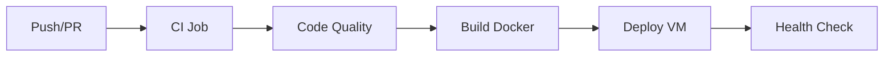

# Manuel de Déploiement - DevClass

## Table des Matières

1. [Vue d'ensemble de l'Architecture](#vue-densemble-de-larchitecture)
2. [Environnements de Déploiement](#environnements-de-déploiement)
3. [Configuration Docker](#configuration-docker)
4. [Pipeline CI/CD](#pipeline-cicd)
5. [Déploiement Manuel](#déploiement-manuel)
6. [Monitoring et Maintenance](#monitoring-et-maintenance)
7. [Procédures d'Urgence](#procédures-durgence)
8. [Sécurité et Bonnes Pratiques](#sécurité-et-bonnes-pratiques)

---

## Vue d'ensemble de l'Architecture

### Architecture de Déploiement

DevClass utilise une architecture moderne basée sur des conteneurs Docker avec les composants suivants :

```
┌─────────────────┐    ┌──────────────────┐    ┌─────────────────┐
│   Utilisateur   │────│     Traefik      │────│  DevClass App   │
│   (Browser)     │    │ (Reverse Proxy)  │    │  (React + SPA)  │
└─────────────────┘    └──────────────────┘    └─────────────────┘
                                │                        │
                                │                        │
                       ┌──────────────────┐    ┌─────────────────┐
                       │   Let's Encrypt  │    │  Backend API    │
                       │ (SSL Certificates)│    │ (schooldev.*)   │
                       └──────────────────┘    └─────────────────┘
```

### Choix Technologiques Justifiés

#### Docker Multi-Stage Build
**Pourquoi :** Optimisation de la taille de l'image et sécurité
```dockerfile
# Stage 1: Build (Node.js 18 Alpine)
FROM node:18-alpine AS build
# - Taille réduite avec Alpine Linux
# - Node.js 18 LTS pour la stabilité
# - Environnement de build complet

# Stage 2: Production (Nginx Alpine)
FROM nginx:alpine
# - Serveur web haute performance
# - Empreinte mémoire minimale
# - Sécurité renforcée (utilisateur non-root)
```

#### Nginx comme Serveur Web
**Avantages :**
- **Performance** : Gestion efficace des fichiers statiques
- **SPA Support** : Configuration `try_files` pour React Router
- **Compression** : Gzip automatique pour réduire la bande passante
- **Sécurité** : Headers de sécurité intégrés

#### Traefik comme Reverse Proxy
**Justification :**
- **Auto-discovery** : Configuration automatique via labels Docker
- **SSL/TLS** : Certificats Let's Encrypt automatiques
- **Load Balancing** : Répartition de charge native
- **Monitoring** : Dashboard intégré et métriques

---

## Environnements de Déploiement

### 1. Environnement de Développement Local

#### Configuration
```bash
# Prérequis
node --version  # v20.x recommandé
npm --version   # v10.x recommandé
docker --version # v24.x recommandé

# Structure projet
Projet_file_rouge_FRONT/
├── devClass/          # Code source principal
│   ├── src/          # Code React
│   ├── Dockerfile    # Configuration conteneur
│   ├── nginx.conf    # Configuration Nginx
│   └── package.json  # Dépendances npm
└── docker-compose.yml # Orchestration locale
```

#### Démarrage Local
```bash
cd Projet_file_rouge_FRONT/devClass/

# Développement avec hot-reload
npm ci
npm run dev
# → http://localhost:5173

# Test de production locale
npm run build
npm run preview
# → http://localhost:4173
```

### 2. Environnement de Staging

#### Configuration GitHub Actions
```yaml
# Déclenchement automatique sur PR
on:
  pull_request:
    branches: [ main ]
    
# Environnement isolé pour tests
environment:
  name: staging
  url: https://staging-schooldev.duckdns.org
```

### 3. Environnement de Production

#### Infrastructure Azure VM
```
Serveur: Azure Standard B2s
OS: Ubuntu 22.04 LTS
RAM: 4 GB
Storage: 30 GB SSD
Network: DuckDNS (app-schooldev.duckdns.org)
```

#### Configuration Réseau
```yaml
# docker-compose.yml - Production
networks:
  web:
    name: web        # Réseau partagé avec Traefik
    external: true   # Créé par l'infrastructure
```

---

## Configuration Docker

### Dockerfile Multi-Stage Détaillé

```dockerfile
# ================================
# STAGE 1: BUILD ENVIRONMENT
# ================================
FROM node:18-alpine AS build

# Justification Node.js 18 Alpine :
# - LTS stable avec support ESM natif
# - Alpine Linux : sécurité + taille réduite
# - Compatibilité optimale avec Vite

WORKDIR /app

# Optimisation cache Docker
# Copier package*.json en premier pour cache layer
COPY package*.json ./
RUN npm ci --ignore-scripts

# Arguments de build pour optimisation
ARG NODE_ENV=production
ARG VITE_API_BASE_URL=https://schooldev.duckdns.org/api
ARG VITE_PISTON_API_URL=https://emkc.org/api/v2/piston

# Copie du code source
COPY src/ ./src/
COPY public/ ./public/
COPY index.html ./
COPY vite.config.js ./

# Build optimisé pour production
RUN npm run build

# ================================
# STAGE 2: PRODUCTION SERVER
# ================================
FROM nginx:alpine

# Justification Nginx Alpine :
# - Performance éprouvée pour SPA
# - Empreinte mémoire < 10MB
# - Configuration flexible

# Copie des fichiers buildés
COPY --from=build /app/dist /usr/share/nginx/html

# Configuration Nginx optimisée
COPY nginx.conf /etc/nginx/conf.d/default.conf

# Sécurité : utilisateur non-root
RUN addgroup -g 1001 -S nginx && \
    adduser -S nginx -G nginx

# Port exposition
EXPOSE 80

# Commande de démarrage
CMD ["nginx", "-g", "daemon off;"]
```

### Configuration Nginx Optimisée

```nginx
# nginx.conf
server {
    listen 80;
    server_name localhost;
    root /usr/share/nginx/html;
    index index.html;

    # ==============================
    # SPA ROUTING SUPPORT
    # ==============================
    # Essentiel pour React Router
    location / {
        try_files $uri $uri/ /index.html;
    }

    # ==============================
    # HEADERS DE SÉCURITÉ
    # ==============================
    # Protection XSS
    add_header X-Frame-Options "SAMEORIGIN" always;
    add_header X-Content-Type-Options "nosniff" always;
    add_header X-XSS-Protection "1; mode=block" always;
    
    # CSP pour sécurité renforcée
    add_header Content-Security-Policy "default-src 'self'; script-src 'self' 'unsafe-inline' 'unsafe-eval'; style-src 'self' 'unsafe-inline'; img-src 'self' data: https:; connect-src 'self' https://schooldev.duckdns.org https://emkc.org;" always;

    # ==============================
    # OPTIMISATIONS PERFORMANCE
    # ==============================
    # Compression Gzip
    gzip on;
    gzip_vary on;
    gzip_min_length 1024;
    gzip_types 
        text/plain 
        text/css 
        text/xml 
        text/javascript 
        application/javascript 
        application/xml+rss 
        application/json
        application/manifest+json;

    # Cache statique
    location ~* \.(js|css|png|jpg|jpeg|gif|ico|svg|woff|woff2)$ {
        expires 1y;
        add_header Cache-Control "public, immutable";
    }

    # Cache HTML (court pour SPA)
    location ~* \.html$ {
        expires 1h;
        add_header Cache-Control "public, must-revalidate";
    }
}
```

### Docker Compose Production

```yaml
# docker-compose.yml
version: '3.8'

services:
  frontend:
    image: matias151/schooldev_front:latest
    container_name: schooldev_front
    restart: unless-stopped
    
    # ==============================
    # CONFIGURATION RÉSEAU
    # ==============================
    networks:
      - web  # Réseau partagé avec Traefik
    
    # ==============================
    # VARIABLES D'ENVIRONNEMENT
    # ==============================
    environment:
      - NODE_ENV=production
      
    # ==============================
    # LABELS TRAEFIK
    # ==============================
    labels:
      # Activation Traefik
      - "traefik.enable=true"
      
      # Configuration du routage
      - "traefik.http.routers.frontend.rule=Host(`app-schooldev.duckdns.org`)"
      - "traefik.http.routers.frontend.entrypoints=web,websecure"
      
      # Configuration SSL
      - "traefik.http.routers.frontend.tls.certresolver=myresolver"
      
      # Port du service
      - "traefik.http.services.frontend.loadbalancer.server.port=80"
      
      # Redirection HTTPS
      - "traefik.http.routers.frontend-redirect.rule=Host(`app-schooldev.duckdns.org`)"
      - "traefik.http.routers.frontend-redirect.entrypoints=web"
      - "traefik.http.routers.frontend-redirect.middlewares=frontend-redirect"
      - "traefik.http.middlewares.frontend-redirect.redirectscheme.scheme=https"

# ==============================
# RÉSEAUX
# ==============================
networks:
  web:
    name: web
    external: true  # Créé par l'infrastructure Traefik
```

---

## Pipeline CI/CD

### Architecture GitHub Actions



### Workflow Détaillé

#### 1. Intégration Continue (CI)

```yaml
# .github/workflows/deploy.yml
name: CI/CD Pipeline

on:
  push:
    branches: [ main ]
  pull_request:
    branches: [ main ]
    types: [opened, synchronize, reopened]

jobs:
  ci:
    name: Continuous Integration
    runs-on: ubuntu-latest
    
    steps:
    # ==============================
    # PRÉPARATION ENVIRONNEMENT
    # ==============================
    - name: Checkout code
      uses: actions/checkout@v4
      with:
        fetch-depth: 0  # Nécessaire pour SonarQube
        
    - name: Set up Node.js
      uses: actions/setup-node@v4
      with:
        node-version: '20'
        cache: 'npm'
        cache-dependency-path: devClass/package-lock.json
        
    - name: Install dependencies
      run: |
        cd devClass
        npm ci --prefer-offline --no-audit
        
    # ==============================
    # QUALITÉ DU CODE
    # ==============================
    - name: Run linter
      run: |
        cd devClass
        npm run lint
        
    - name: Run type check
      run: |
        cd devClass
        npm run typecheck || echo "TypeScript check completed"
        
    # ==============================
    # TESTS AUTOMATISÉS
    # ==============================
    - name: Run tests
      run: |
        cd devClass
        npm run test:ci
        
    # ==============================
    # BUILD DE VALIDATION
    # ==============================
    - name: Build application
      run: |
        cd devClass
        npm run build
        
    - name: Upload build artifacts
      uses: actions/upload-artifact@v4
      with:
        name: build-artifacts
        path: devClass/dist
        retention-days: 1
```

#### 2. Analyse Qualité

```yaml
  code-quality:
    name: Code Quality Analysis
    needs: ci
    runs-on: ubuntu-latest
    
    steps:
      - uses: actions/checkout@v4
        with:
          fetch-depth: 0
          
      - name: Set up Node.js
        uses: actions/setup-node@v4
        with:
          node-version: '20'
          cache: 'npm'
          cache-dependency-path: devClass/package-lock.json
          
      - name: Install dependencies
        run: |
          cd devClass
          npm ci
          
      # ==============================
      # TESTS AVEC COUVERTURE
      # ==============================
      - name: Run tests with coverage
        run: |
          cd devClass
          npm run test:coverage
          
      # ==============================
      # ANALYSE SONARQUBE
      # ==============================
      - name: SonarQube Scan
        uses: SonarSource/sonarqube-scan-action@v5
        with:
          projectBaseDir: devClass
        env:
          SONAR_TOKEN: ${{ secrets.SONAR_TOKEN }}
          
      # ==============================
      # AUDIT SÉCURITÉ
      # ==============================
      - name: Security audit
        run: |
          cd devClass
          npm audit --audit-level moderate
```

#### 3. Déploiement Production

```yaml
  deploy:
    name: Deploy to VM
    needs: [ci, code-quality]
    runs-on: ubuntu-latest
    if: github.ref == 'refs/heads/main' && github.event_name == 'push'
    
    environment:
      name: production
      url: https://app-schooldev.duckdns.org
    
    steps:
    # ==============================
    # PRÉPARATION ARTEFACTS
    # ==============================
    - name: Checkout code
      uses: actions/checkout@v4
        
    - name: Download build artifacts
      uses: actions/download-artifact@v4
      with:
        name: build-artifacts
        path: devClass/dist
        
    # ==============================
    # BUILD DOCKER IMAGE
    # ==============================
    - name: Set up Docker Buildx
      uses: docker/setup-buildx-action@v3
      
    - name: Login to Docker Hub
      uses: docker/login-action@v3
      with:
        username: ${{ secrets.DOCKER_USERNAME }}
        password: ${{ secrets.DOCKER_PASSWORD }}
        
    - name: Build and push Docker image
      uses: docker/build-push-action@v5
      with:
        context: ./devClass
        push: true
        tags: |
          matias151/schooldev_front:latest
          matias151/schooldev_front:${{ github.sha }}
        labels: |
          org.opencontainers.image.title=SchoolDev Frontend
          org.opencontainers.image.description=React frontend for SchoolDev platform
          org.opencontainers.image.source=https://github.com/${{ github.repository }}
          org.opencontainers.image.revision=${{ github.sha }}
        cache-from: type=gha
        cache-to: type=gha,mode=max
        
    # ==============================
    # DÉPLOIEMENT SUR VM
    # ==============================
    - name: Deploy to VM
      uses: appleboy/ssh-action@v1.0.0
      with:
        host: ${{ secrets.VM_HOST }}
        username: ${{ secrets.VM_USER }}
        key: ${{ secrets.VM_SSH_KEY }}
        script: |
          # Configuration projet
          PROJECT_DIR="/home/azureuser/Projet_file_rouge_FRONT"
          
          # Création répertoire si nécessaire
          if [ ! -d "$PROJECT_DIR" ]; then
            echo "🚀 Premier déploiement - clonage du repository..."
            cd /home/azureuser/
            git clone https://github.com/${{ github.repository }}.git Projet_file_rouge_FRONT
          fi
          
          # Mise à jour du code
          cd $PROJECT_DIR
          git fetch
          git checkout main
          git pull origin main
          
          # Création réseau Docker partagé
          docker network create web || echo "Réseau 'web' déjà existant"
          
          # Déploiement application
          echo "📦 Déploiement de l'application..."
          docker-compose pull frontend
          docker-compose up -d frontend
          
          # Vérification santé
          echo "🔍 Vérification de l'état du conteneur..."
          docker ps | grep schooldev_front
          
          # Test de connectivité
          echo "🌐 Test de connectivité..."
          curl -f http://localhost || echo "Service démarrant..."
```

---

## Déploiement Manuel

### Prérequis Serveur

#### Configuration Azure VM
```bash
# Connexion au serveur
ssh azureuser@<vm-ip>

# Mise à jour système
sudo apt update && sudo apt upgrade -y

# Installation Docker
curl -fsSL https://get.docker.com -o get-docker.sh
sh get-docker.sh
sudo usermod -aG docker $USER

# Installation Docker Compose
sudo apt install docker-compose-plugin -y

# Vérification installations
docker --version
docker compose version
```

#### Configuration réseau
```bash
# Création du réseau Traefik
docker network create web

# Vérification réseau
docker network ls | grep web
```

### Procédure de Déploiement Manuel

#### 1. Préparation du Code
```bash
# Sur la machine de développement
git checkout main
git pull origin main

# Test local avant déploiement
cd devClass/
npm ci
npm run lint
npm run test:ci
npm run build
```

#### 2. Build de l'Image Docker
```bash
# Construction locale
cd devClass/
docker build -t devclass-front:local .

# Test local
docker run -p 8080:80 devclass-front:local
curl http://localhost:8080

# Push vers registry
docker tag devclass-front:local matias151/schooldev_front:manual-$(date +%Y%m%d)
docker push matias151/schooldev_front:manual-$(date +%Y%m%d)
```

#### 3. Déploiement sur le Serveur
```bash
# Connexion au serveur
ssh azureuser@<vm-host>

# Navigation vers le projet
cd /home/azureuser/Projet_file_rouge_FRONT

# Mise à jour du code
git pull origin main

# Mise à jour de l'image
docker-compose pull frontend

# Arrêt gracieux du service actuel
docker-compose down frontend

# Démarrage du nouveau service
docker-compose up -d frontend

# Vérification du déploiement
docker-compose ps
docker logs schooldev_front --tail=20
```

#### 4. Tests Post-Déploiement
```bash
# Test de connectivité locale
curl -I http://localhost

# Test externe
curl -I https://app-schooldev.duckdns.org

# Vérification des logs
docker logs schooldev_front --follow
```

---

## Monitoring et Maintenance

### Monitoring de l'Application

#### Métriques Docker
```bash
# État des conteneurs
docker ps -a
docker stats schooldev_front

# Utilisation des ressources
docker system df
docker system prune -f  # Nettoyage (avec précaution)
```

#### Métriques Système
```bash
# Utilisation CPU/RAM
htop
free -h
df -h

# Logs système
journalctl -u docker.service --since "1 hour ago"
```

#### Logs Application
```bash
# Logs en temps réel
docker logs schooldev_front --follow

# Logs avec timestamps
docker logs schooldev_front --timestamps --since="2024-01-01"

# Logs d'erreur uniquement
docker logs schooldev_front 2>&1 | grep -i error
```

### Maintenance Préventive

#### Tâches Quotidiennes
```bash
#!/bin/bash
# scripts/daily-maintenance.sh

echo "🔍 Vérification quotidienne DevClass - $(date)"

# Vérification état conteneur
if ! docker ps | grep -q schooldev_front; then
    echo "❌ Conteneur arrêté - redémarrage automatique"
    docker-compose up -d frontend
fi

# Vérification connectivité
if ! curl -f https://app-schooldev.duckdns.org > /dev/null 2>&1; then
    echo "❌ Application inaccessible"
    # Notification équipe (à configurer)
fi

# Nettoyage logs anciens
docker logs schooldev_front --tail=1000 > /tmp/app-logs-$(date +%Y%m%d).log

echo "✅ Vérification terminée"
```

#### Tâches Hebdomadaires
```bash
#!/bin/bash
# scripts/weekly-maintenance.sh

echo "🧹 Maintenance hebdomadaire DevClass - $(date)"

# Mise à jour images Docker
docker-compose pull

# Nettoyage images inutilisées
docker image prune -f

# Sauvegarde configuration
cp docker-compose.yml docker-compose.yml.backup-$(date +%Y%m%d)

# Vérification espace disque
df -h | grep -E "(root|home)"

echo "✅ Maintenance hebdomadaire terminée"
```

### Alertes et Notifications

#### Configuration d'Alertes
```bash
# Installation monitoring simple
sudo apt install monit

# Configuration /etc/monit/monitrc
check process nginx with pidfile /var/run/nginx.pid
    start program = "/usr/bin/docker-compose -f /home/azureuser/Projet_file_rouge_FRONT/docker-compose.yml up -d frontend"
    stop program = "/usr/bin/docker-compose -f /home/azureuser/Projet_file_rouge_FRONT/docker-compose.yml down frontend"
    if failed host app-schooldev.duckdns.org port 443 protocol https then restart
    if 5 restarts within 5 cycles then timeout
```

---

## Procédures d'Urgence

### Diagnostic Rapide

#### Checklist de Diagnostic
```bash
# 1. Vérification conteneur
docker ps | grep schooldev_front
# ✅ Doit montrer STATUS "Up X minutes"

# 2. Vérification logs récents
docker logs schooldev_front --tail=50
# ✅ Pas d'erreurs critiques

# 3. Test connectivité interne
curl -I http://localhost
# ✅ HTTP/1.1 200 OK

# 4. Test connectivité externe
curl -I https://app-schooldev.duckdns.org
# ✅ HTTP/2 200

# 5. Vérification réseau Docker
docker network ls | grep web
# ✅ Réseau 'web' existant

# 6. Vérification Traefik (si géré)
docker ps | grep traefik
# ✅ Traefik en fonctionnement
```

### Procédures de Récupération

#### 1. Redémarrage Simple
```bash
# Redémarrage du conteneur
docker-compose restart frontend

# Vérification
docker-compose ps
curl -I https://app-schooldev.duckdns.org
```

#### 2. Redéploiement Complet
```bash
# Arrêt complet
docker-compose down frontend

# Nettoyage (avec précaution)
docker system prune -f

# Redémarrage réseau si nécessaire
docker network rm web
docker network create web

# Redéploiement
docker-compose pull frontend
docker-compose up -d frontend
```

#### 3. Rollback d'Urgence
```bash
# Rollback vers version précédente
docker tag matias151/schooldev_front:latest matias151/schooldev_front:rollback-$(date +%Y%m%d)
docker pull matias151/schooldev_front:<previous-tag>
docker tag matias151/schooldev_front:<previous-tag> matias151/schooldev_front:latest

# Redéploiement
docker-compose down frontend
docker-compose up -d frontend
```

#### 4. Récupération Serveur Complet
```bash
# En cas de panne serveur complète
ssh azureuser@<vm-host>

# Vérification services système
sudo systemctl status docker
sudo systemctl start docker  # Si arrêté

# Restauration projet
cd /home/azureuser/
git clone https://github.com/username/Projet_file_rouge_FRONT.git  # Si perdu

# Récréation environnement
docker network create web
cd Projet_file_rouge_FRONT/
docker-compose up -d frontend
```

### Plan de Continuité

#### Contacts d'Urgence
```
Niveau 1 (0-2h) : Équipe DevOps
- Slack : #devops-alerts
- Tel : +33 X XX XX XX XX

Niveau 2 (2-4h) : Tech Lead
- Email : tech.lead@company.com
- Tel : +33 X XX XX XX XX

Niveau 3 (4h+) : Direction Technique
- Email : cto@company.com
```

#### Procédure d'Escalade
1. **0-15min** : Diagnostic automatique et redémarrage simple
2. **15-60min** : Investigation logs et redéploiement
3. **60-120min** : Escalade équipe DevOps
4. **2h+** : Escalade direction technique

---

## Sécurité et Bonnes Pratiques

### Sécurité Container

#### Configuration Sécurisée
```yaml
# docker-compose.yml - Options sécurité
services:
  frontend:
    # Utilisateur non-root
    user: "1001:1001"
    
    # Limitations ressources
    deploy:
      resources:
        limits:
          memory: 512M
          cpus: '0.5'
        reservations:
          memory: 256M
          cpus: '0.25'
    
    # Sécurité réseau
    networks:
      - web
    
    # Variables d'environnement sécurisées
    environment:
      - NODE_ENV=production
    
    # Pas de privilèges élevés
    privileged: false
    
    # Montages en lecture seule
    volumes:
      - type: tmpfs
        target: /tmp
        tmpfs:
          size: 100M
```

#### Secrets Management
```bash
# Utilisation Docker Secrets (si Swarm)
echo "production-api-key" | docker secret create api_key -

# Ou variables d'environnement sécurisées
export VITE_API_BASE_URL="https://schooldev.duckdns.org/api"
docker-compose up -d
```

### Audit de Sécurité

#### Scan d'Images Docker
```bash
# Analyse vulnérabilités avec Trivy
docker run --rm -v /var/run/docker.sock:/var/run/docker.sock \
  aquasec/trivy image matias151/schooldev_front:latest

# Analyse avec Docker Scout
docker scout cves matias151/schooldev_front:latest
```

#### Hardening Système
```bash
# Mise à jour sécurité automatique
sudo apt install unattended-upgrades
sudo dpkg-reconfigure -plow unattended-upgrades

# Firewall de base
sudo ufw enable
sudo ufw allow 22/tcp   # SSH
sudo ufw allow 80/tcp   # HTTP
sudo ufw allow 443/tcp  # HTTPS
```

### Sauvegarde et Récupération

#### Stratégie de Sauvegarde
```bash
#!/bin/bash
# scripts/backup.sh

BACKUP_DIR="/home/azureuser/backups"
DATE=$(date +%Y%m%d_%H%M%S)

# Création répertoire sauvegarde
mkdir -p $BACKUP_DIR

# Sauvegarde configuration
tar -czf $BACKUP_DIR/config-$DATE.tar.gz \
  docker-compose.yml \
  nginx.conf \
  .env

# Sauvegarde images Docker locales
docker save matias151/schooldev_front:latest | gzip > $BACKUP_DIR/image-$DATE.tar.gz

# Nettoyage anciennes sauvegardes (> 30 jours)
find $BACKUP_DIR -name "*.tar.gz" -mtime +30 -delete

echo "✅ Sauvegarde terminée : $BACKUP_DIR"
```

#### Test de Récupération
```bash
# Test mensuel de récupération
# 1. Simulation panne
docker-compose down
docker system prune -af

# 2. Récupération depuis sauvegarde
cd /home/azureuser/backups
tar -xzf config-<latest>.tar.gz
docker load < image-<latest>.tar.gz

# 3. Redémarrage
docker-compose up -d

# 4. Validation
curl -I https://app-schooldev.duckdns.org
```

---

## Performance et Optimisation

### Métriques de Performance

#### Objectifs de Performance
- **Time to First Byte (TTFB)** : < 200ms
- **First Contentful Paint** : < 1.5s
- **Largest Contentful Paint** : < 2.5s
- **Cumulative Layout Shift** : < 0.1

#### Monitoring Performance
```bash
# Test Lighthouse automatisé
npx lighthouse https://app-schooldev.duckdns.org \
  --output json \
  --output-path lighthouse-report.json \
  --only-categories performance,accessibility,best-practices

# Analyse des métriques Core Web Vitals
curl -s "https://www.googleapis.com/pagespeedonline/v5/runPagespeed?url=https://app-schooldev.duckdns.org&category=performance"
```

### Optimisations Nginx

#### Configuration Avancée
```nginx
# nginx.conf - Optimisations supplémentaires
server {
    # ... configuration de base ...
    
    # Optimisation connexions
    keepalive_timeout 65;
    keepalive_requests 100;
    
    # Compression Brotli (si disponible)
    brotli on;
    brotli_comp_level 4;
    brotli_types text/plain text/css application/json application/javascript text/xml application/xml application/xml+rss text/javascript;
    
    # Headers performance
    add_header X-Cache-Status $upstream_cache_status always;
    
    # Préchargement DNS
    add_header Link "</assets/font.woff2>; rel=preload; as=font; type=font/woff2; crossorigin" always;
    
    # Configuration cache granulaire
    location ~* \.(js|css)$ {
        expires 1y;
        add_header Cache-Control "public, immutable";
        add_header Vary "Accept-Encoding";
    }
    
    location ~* \.(png|jpg|jpeg|gif|ico|svg)$ {
        expires 6M;
        add_header Cache-Control "public";
    }
}
```

---

## Documentation et Formation

### Documentation Technique

#### Architecture Decision Records (ADR)
```markdown
# ADR-001: Choix de Nginx pour le serveur web

## Statut
Accepté

## Contexte
Besoin d'un serveur web performant pour servir l'application React SPA

## Décision
Utilisation de Nginx Alpine dans un conteneur Docker

## Conséquences
+ Performance optimale pour fichiers statiques
+ Configuration SPA native (try_files)
+ Empreinte mémoire réduite
- Courbe d'apprentissage configuration
```

### Formation Équipe

#### Checklist Onboarding
- [ ] Accès repository GitHub
- [ ] Configuration environnement local
- [ ] Formation Docker/Docker Compose
- [ ] Procédures de déploiement
- [ ] Monitoring et logs
- [ ] Procédures d'urgence

#### Resources de Formation
- **Docker** : https://docs.docker.com/get-started/
- **Nginx** : https://nginx.org/en/docs/
- **React Deployment** : https://create-react-app.dev/docs/deployment/
- **CI/CD Best Practices** : https://docs.github.com/en/actions

---

## Annexes

### Variables d'Environnement

#### Production
```env
# Application
NODE_ENV=production
VITE_API_BASE_URL=https://schooldev.duckdns.org/api
VITE_PISTON_API_URL=https://emkc.org/api/v2/piston

# Docker
DOCKER_BUILDKIT=1
COMPOSE_DOCKER_CLI_BUILD=1
```

#### Secrets GitHub Actions
```
DOCKER_USERNAME: matias151
DOCKER_PASSWORD: <token-docker-hub>
VM_HOST: <ip-azure-vm>
VM_USER: azureuser
VM_SSH_KEY: <private-key>
SONAR_TOKEN: <token-sonarqube>
```

### Ports et URLs

#### Configuration Réseau
```
Développement:
- Frontend: http://localhost:5173
- Preview: http://localhost:4173

Production:
- Application: https://app-schooldev.duckdns.org
- API Backend: https://schooldev.duckdns.org/api
- Traefik Dashboard: https://traefik.schooldev.duckdns.org (si configuré)
```

### Contacts et Support

#### Équipe Technique
- **DevOps Lead** : Configuration infrastructure et déploiements
- **Frontend Lead** : Architecture React et performance
- **Security Officer** : Audit sécurité et conformité

#### Support External
- **Azure Support** : Infrastructure cloud
- **DuckDNS** : Gestion domaine
- **Docker Hub** : Registry images
- **GitHub** : CI/CD et repository

---

*Ce manuel est maintenu à jour avec l'évolution de l'infrastructure DevClass. Dernière révision : $(date +%Y-%m-%d)*